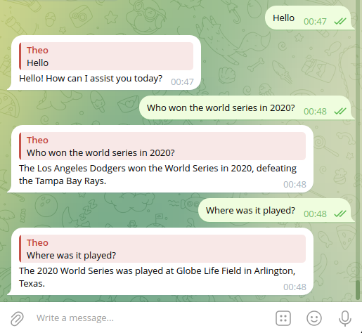

<p align="center">
    
</p>

<p align="center">
  <a href="https://github.com/TheoBrigitte/chatgpt-telegram-bot/releases"></a>
  <a href="https://github.com/TheoBrigitte/chatgpt-telegram-bot/actions/workflows/build.yml"></a>
</p>


### About

OpenAI ChatGPT is a conversational AI model that generates human-like text. This Telegram bot allows users to interact with the model directly from the Telegram app.

### Screenshots

<p align="center">
    
</p>

### Quickstart

```
git clone git@github.com:TheoBrigitte/chatgpt-telegram-bot.git
cd chatgpt-telegram-bot
cp config.env.example config.env
$EDITOR config.env    # fill in the required environment variables
source config.env
go build -v
./chatgpt-telegram-bot run
```

### Features

- Send a message to the bot to get a response from the ChatGPT Model
- Set system role with `/setrole` command
- Clear chat session (history and role) with `/clear` command
- Clear chat history with `/clearhistory` command
- Clear system role with `/clearrole` command

### Configuration

Configuration is done through environment variables.

Copy the [config.env.example](config.env.example) file to `config.env` and fill in the required environment variables.

The following variables are available:

- `OPENAI_API_KEY`: Your OpenAI API key, you can get it from [here](https://platform.openai.com/account/api-keys)
- `TELEGRAM_BOT_TOKEN`: Your Telegram bot's token, you can get it using [this tutorial](https://core.telegram.org/bots/tutorial#obtain-your-bot-token)

### Credits

- [sashabaranov/go-openai](https://github.com/sashabaranov/go-openai)
- [tucnak/telebot](https://github.com/tucnak/telebot)
